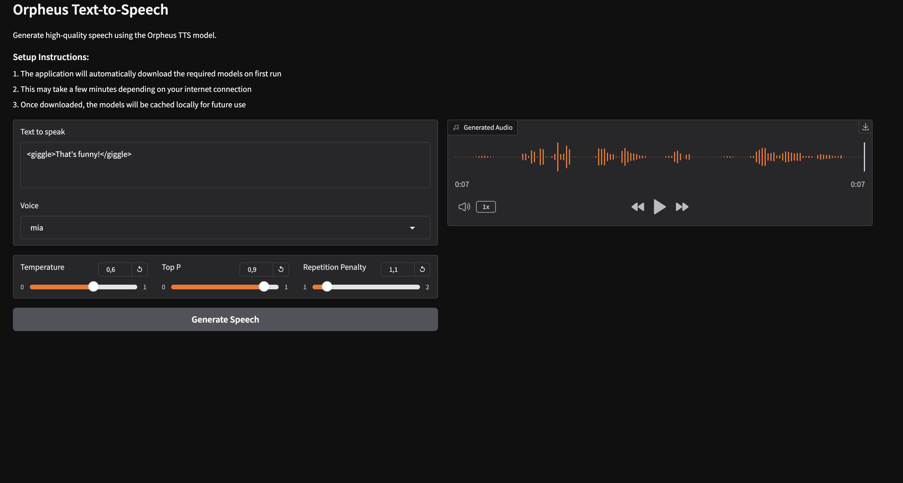

# Orpheus-TTS-Local

A standalone Text-to-Speech application using the [Orpheus TTS model](https://huggingface.co/canopylabs/orpheus-3b-0.1-ft) with a modern Gradio interface.

## UI Screenshots:


## Features

- 🎧 High-quality Text-to-Speech using the Orpheus TTS model
- 💻 Completely standalone - no external services or API keys needed
- 🔊 Multiple voice options (tara, leah, jess, leo, dan, mia, zac, zoe)
- 💾 Save audio to WAV files
- 🎨 Modern Gradio web interface
- 🔧 Adjustable generation parameters (temperature, top_p, repetition penalty)
- 😊 Emotive speech generation with natural expressions

## Sample Audio

Listen to a sample of the generated speech:
[Sample Audio](https://voipnuggets.wordpress.com/wp-content/uploads/2025/03/tmpxxe176lm-1.wav)

## Quick Setup

1. Install Python 3.8 or higher
2. Install dependencies:
   ```bash
   python3 -m venv venv
   source venv/bin/activate  # On Windows: venv\Scripts\activate
   pip install -r requirements.txt
   ```
3. Run the application:
   ```bash
   python gradio_orpheus.py
   ```

The application will automatically:
- Download the Orpheus TTS model on first run
- Download and initialize the SNAC audio codec
- Start the Gradio web interface

## Usage

1. Open your web browser and navigate to the URL shown in the terminal (usually http://127.0.0.1:7860)
2. Enter the text you want to convert to speech
3. Select a voice from the dropdown menu
4. Adjust generation parameters if desired:
   - Temperature: Controls randomness (0.0-1.0)
   - Top P: Controls diversity (0.0-1.0)
   - Repetition Penalty: Controls repetition (1.0-2.0)
5. Click "Generate Speech" to create the audio
6. Play the generated audio directly in the browser or download it

### Sample Prompts

#### Regular Text-to-Speech
```
Welcome to our presentation. Today, we'll be discussing the latest developments in artificial intelligence and machine learning.
```

#### Emotive Text-to-Speech
```
<giggle>Oh, that's hilarious!</giggle> I can't believe what just happened. <laugh>This is the funniest thing I've seen all day!</laugh>
<sigh>But seriously though,</sigh> we need to focus on the task at hand. <gasp>Look at what we've accomplished!</gasp>
```

## Available Voices

- tara - Best overall voice for general use (default)
- leah
- jess
- leo
- dan
- mia
- zac
- zoe

## Emotion Tags

You can add emotion to the speech by adding the following tags:
```xml
<giggle>
<laugh>
<chuckle>
<sigh>
<cough>
<sniffle>
<groan>
<yawn>
<gasp>
```

## Technical Details

This implementation:
- Uses `llama-cpp-python` to run the Orpheus model locally
- Uses the SNAC neural audio codec for high-quality audio generation
- Processes tokens in chunks of 28 for optimal audio quality
- Supports both CPU and GPU (CUDA/MPS) acceleration

## Requirements

- Python 3.8 or higher
- 8GB RAM minimum (16GB recommended)
- CUDA-capable GPU (optional, for faster generation)
- See `requirements.txt` for Python package dependencies

## License

Apache 2.0

